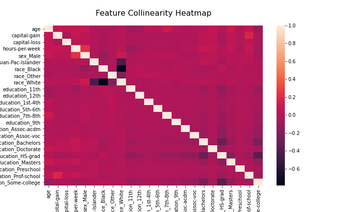
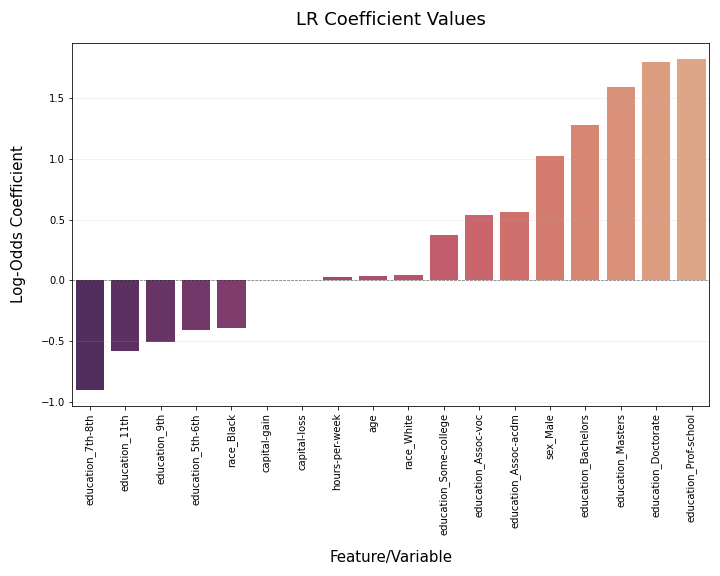
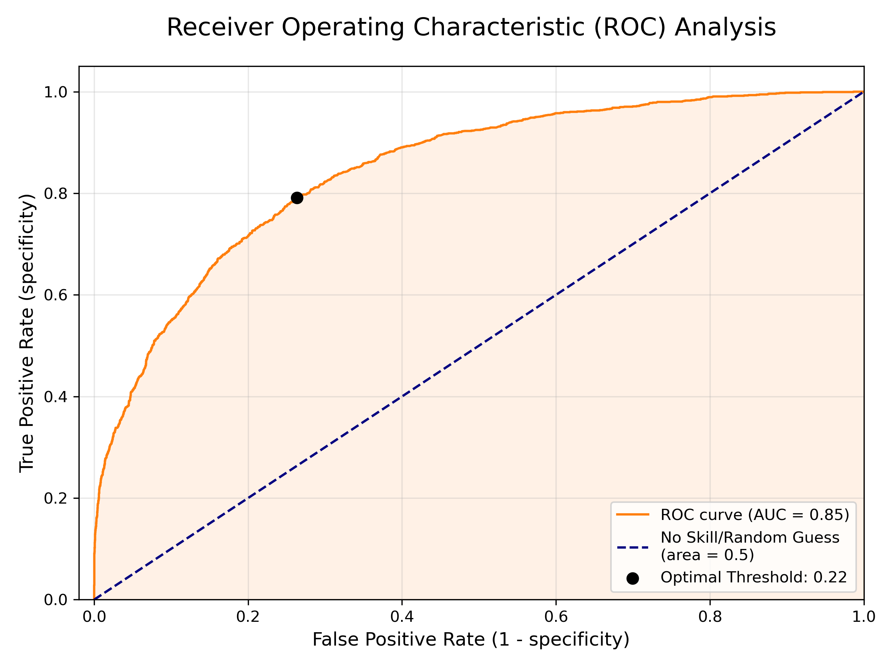

# Income Classification using Logistic Regression

This project implements a Logistic Regression model to predict whether an individual's annual income exceeds \$50,000 based on 1994 Census data. The analysis focuses on balancing predictive accuracy with model interpretability through L1 Regularization (Lasso).

## 📊 Project Overview

The goal was to identify the most significant demographic and financial drivers of high income. By dummy-encoding categorical variables and applying a sparsity-inducing penalty, the model automatically performed feature selection, highlighting the "weight" of education, age, and systemic disparities.

## Model Assumptions 

## 📈 Key Findings

- <b>Feature Importance</b>: Advanced degrees (Doctorate and Professional School) were the strongest positive predictors of high income.

- <b>Systemic Insights</b>: The model identified significant negative correlations for specific racial and gender categories, suggesting measurable economic disparities even when controlling for hours worked and age.

- <b>Regularization</b>: L1 regularization successfully zeroed out redundant features (e.g., specific race and education sub-categories), resulting in a leaner, more generalized model.

## 🧪 Model Performance

- Accuracy: 82.77\%
- ROC AUC Score: 0.85
- Optimal Threshold: Calculated via Youden’s J-Statistic to balance the trade-off between Sensitivity and Specificity.

